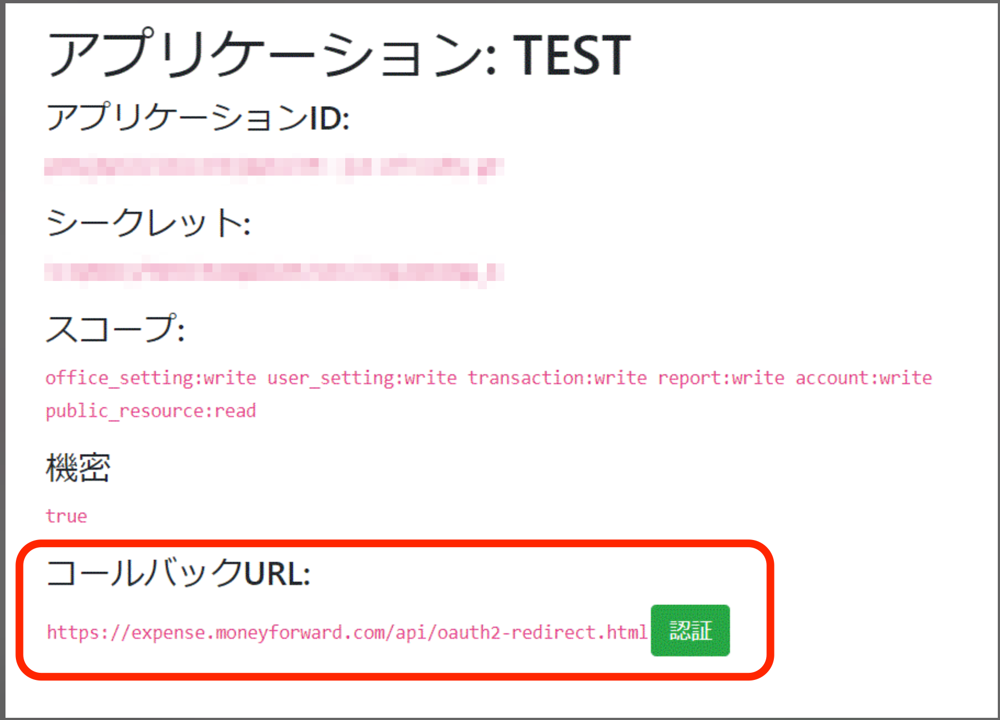
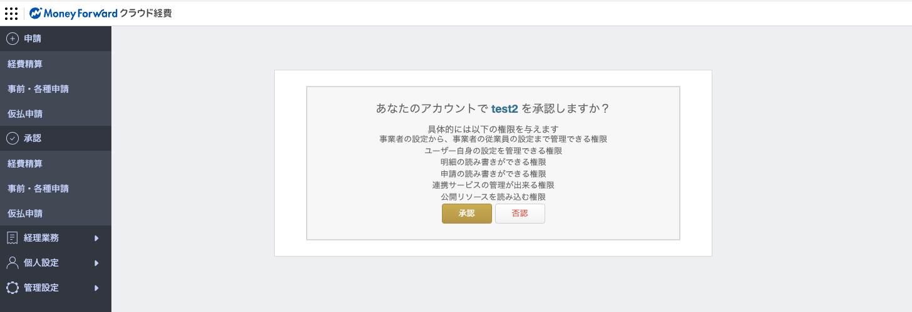

# マネーフォワード クラウド経費・債務支払APIドキュメント

## 概要

本ドキュメントは[マネーフォワード クラウド経費](https://biz.moneyforward.com/expense)のAPI / [マネーフォワード クラウド債務支払](https://biz.moneyforward.com/payable)のAPIについて説明しております。
各APIのリファレンスはこちらをご覧ください。

※ クラウド債務支払については[External API with user token](https://payable.moneyforward.com/api/index.html?urls.primaryName=External%20API%20with%20user%20token)を対象としています。</br>
※ クラウド債務支払の[External API with office token](https://payable.moneyforward.com/api/index.html?urls.primaryName=External%20API%20with%20office%20token)については[お知らせ](https://biz.moneyforward.com/support/payable/news/new-feature/20250415.html)をご覧ください。

- [クラウド経費](https://expense.moneyforward.com/api/index.html)
- [クラウド債務支払](https://payable.moneyforward.com/api/index.html)

ご要望や不具合はメールにてご連絡ください。

詳しいお問い合わせ方法についてはサポートサイト([クラウド経費](https://biz.moneyforward.com/support/expense/guide/support/sup01.html) / [クラウド債務支払](https://biz.moneyforward.com/support/payable/guide/support/sup01.html))をご覧ください。

※ 回答にはお時間をいただきますので、あらかじめご了承ください。

※ お客様環境に関わる構築や仕様確認については回答いたしかねます。

## アクセストークンの発行の流れ

API実行用に用いるアクセストークンの発行はOAuth2.0のAuthorization Code Grantにもとづいて行います。

### 1. アプリケーションの登録

- ご利用になるプロダクト([マネーフォワード クラウド経費](https://expense.moneyforward.com/session/new) または [マネーフォワード クラウド債務支払](https://payable.moneyforward.com/session/new)) にログイン
- 個人設定＞基本設定画面の`API連携（開発者向け）`にある`API連携はこちら`をクリック
- アプリケーションの作成ボタンをクリックし、フォームに必要な情報を入力し、利用規約に同意する、にチェックを入れて作成ボタンをクリックします
- Client IDとClient Secretが発行されます。redirect_uri は https のみ許可しています。

※ クラウド経費、クラウド債務支払の両方をご利用になる場合は、それぞれでアプリケーションの登録をお願いします。クラウド経費の画面で発行したClient IDとClient Secret、またアクセストークンを債務支払のAPI実行に用いること、またその逆での動作は保証しかねます。

### 2. ブラウザ上で認可を行い認可コードの発行

- 前項で発行した Client ID とアプリケーション作成時に入力した値を使い、下記のようなURLにアクセスします。

※ アクセストークンを発行したいユーザーでログインした状態でアクセスしてください。

```
https://expense.moneyforward.com/oauth/authorize?client_id=[CLIENT_ID]&redirect_uri=[REDIRECT_URL]&response_type=code&scope=[SCOPE]
```

- ※ 債務支払の場合はドメインを `payable.moneyforward.com` に読み替えて、以下のURLにアクセスしてください。

```
https://payable.moneyforward.com/oauth/authorize?client_id=[CLIENT_ID]&redirect_uri=[REDIRECT_URL]&response_type=code&scope=[SCOPE]
```

登録したアプリケーション詳細の以下の「認証」ボタンを押すことでもアクセスできます。



URL にアクセスすると以下のような画面に遷移します。記載内容を確認し、承認して問題なければ承認ボタンを押してください。



※ 承認ボタンを押した Money Forward ID ユーザーの権限でアクセストークンが発行されます。

### 3. 認可コードからアクセストークンの発行

- アプリケーションを承認すると　OAuth2 のフローに基づき認可コードつきURLが発行されるので、そのコードを使って以下のようなリクエストをサーバーに発行し、アクセストークン、リフレッシュトークンを取得します。入力に使う[REDIRECT_URL]はアプリケーションの作成時に入力した値を入れてください
- 認可コードの有効期限は10分です。

```
curl -d client_id=[CLIENT_ID] -d client_secret=[CLIENT_SECRET] -d redirect_uri=[REDIRECT_URL] -d grant_type=authorization_code -d code=[認可コード] -X POST https://expense.moneyforward.com/oauth/token
```

※ リクエストを送る際にパラメータは'Content-Type: application/x-www-form-urlencoded'である必要がある点に注意してください。

- ※ 債務支払の場合はドメインを `payable.moneyforward.com` に読み替えて、以下のURLにアクセスしてください。

```
curl -d client_id=[CLIENT_ID] -d client_secret=[CLIENT_SECRET] -d redirect_uri=[REDIRECT_URL] -d grant_type=authorization_code -d code=[認可コード] -X POST https://payable.moneyforward.com/oauth/token
```

### 4. APIリクエスト

- 前項で発行したアクセストークンを`Authorization`ヘッダにセットして以下のようなリクエストをサーバーに発行することでAPIを利用できます。

```
curl https://expense.moneyforward.com/api/external/v1/offices -H "Authorization: Bearer [ACCESS_TOKEN]"
```

上の例は[事業者一覧を取得するAPI](https://expense.moneyforward.com/api/index.html#!/office/find_offices)をリクエストしています。

- ※ 債務支払の場合はドメインを `payable.moneyforward.com` に読み替えて、以下のURLにアクセスしてください。

```
curl https://payable.moneyforward.com/api/external/v1/offices -H "Authorization: Bearer [ACCESS_TOKEN]"
```

## アクセストークン / リフレッシュトークンに関する操作

### リフレッシュトークンを用いたアクセストークンの再発行

- 前項で取得したリフレッシュトークンを利用して、以下のようなリクエストをサーバーに発行します。

```
curl -d client_id=[CLIENT_ID] -d client_secret=[CLIENT_SECRET] -d grant_type=refresh_token -d refresh_token=[REFRESH_TOKEN] -X POST https://expense.moneyforward.com/oauth/token
```

上記により、新しいアクセストークンとリフレッシュトークンを取得できます。

- ※ 債務支払の場合はドメインを `payable.moneyforward.com` に読み替えて、以下のURLにアクセスしてください。

```
curl -d client_id=[CLIENT_ID] -d client_secret=[CLIENT_SECRET] -d grant_type=refresh_token -d refresh_token=[REFRESH_TOKEN] -X POST https://payable.moneyforward.com/oauth/token
```

### アクセストークンの無効化

- 前項で取得したアクセストークンには有効期限が付いています。即時に無効化したい場合は以下のようなリクエストをサーバーに発行して、アクセストークンを無効化します。

```
curl -d client_id=[CLIENT_ID] -d client_secret=[CLIENT_SECRET] -d token=[アクセストークン] -X POST https://expense.moneyforward.com/oauth/revoke
```

- ※ 債務支払の場合はドメインを `payable.moneyforward.com` に読み替えて、以下のURLにアクセスしてください。

```
curl -d client_id=[CLIENT_ID] -d client_secret=[CLIENT_SECRET] -d token=[アクセストークン] -X POST https://payable.moneyforward.com/oauth/revoke
```

### アクセストークンの有効期限の確認

- 前項で取得したアクセストークンが有効かどうか、あるいは有効な場合の有効期限を確認するには、以下のようなリクエストをサーバーに発行します。

```
curl https://expense.moneyforward.com/oauth/token/info -H "Authorization: Bearer [アクセストークン]"
```

- ※ 債務支払の場合はドメインを `payable.moneyforward.com` に読み替えて、以下のURLにアクセスしてください。

```
curl https://payable.moneyforward.com/oauth/token/info -H "Authorization: Bearer [アクセストークン]"
```

アクセストークンが有効な場合、サーバーは以下のような JSON レスポンスを返します。

```json
{"resource_owner_id":"12345","scope":["office_setting:write","user_setting:write","transaction:write","report:write","account:write","public_resource:read"],"expires_in":2775961,"application":{"uid":"[CLIENT_ID]"},"created_at":1648021265}
```

ここで `"expires_in": 2775961` が有効期限 (単位は秒) を表し、トークンが無効になるまで残り 2,775,961 秒 (およそ 32 日) であることを表しています。

アクセストークンが無効な場合、サーバーは以下のような JSON レスポンスを返します。

```json
{"error":"invalid_token","error_description":"アクセストークンが無効です","state":"unauthorized"}
```

## APIリファレンス

マネーフォワードクラウド経費のAPIについては[こちら](https://expense.moneyforward.com/api/index.html)

マネーフォワードクラウド債務支払のAPIについては[こちら](https://payable.moneyforward.com/api/index.html)
